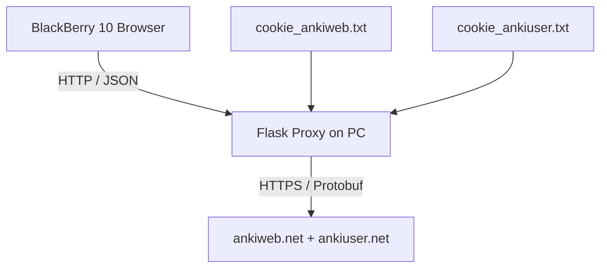

# AnkiWeb Super Lite Web App Cho BlackBerry 10

> Xem [README.md](README.md) để biết tổng quan project, cách cài đặt và chạy nhanh.

Tài liệu này mô tả đầy đủ cách chạy, kết nối và tối ưu bản web app dành cho BlackBerry 10, đặc biệt là BlackBerry Classic với trình duyệt WebKit cũ và bàn phím vật lý QWERTY.

## Mục tiêu của bản web app

Bản web app tồn tại để giải quyết 4 vấn đề mà BlackBerry 10 thường gặp:

1. Trình duyệt cũ không còn tin cậy nhiều chứng chỉ HTTPS hiện đại.
2. Browser WebKit cũ dễ lỗi với CSS và JavaScript mới.
3. Màn hình vuông 1:1 của Q10, Classic, Passport rất chật theo chiều dọc.
4. Trải nghiệm tốt nhất trên BlackBerry không phải là cảm ứng, mà là tận dụng bàn phím vật lý.

Vì vậy bản web này ưu tiên:

- HTTP nội bộ qua LAN hoặc tunnel.
- ES5 thuần, không framework frontend.
- Giao diện học thẻ dạng text-first, dễ scroll, ít hiệu ứng.
- Điều hướng bằng phím cứng trước, cảm ứng sau.

## Kiến trúc



Thành phần chính:

- `templates/index.html`: giao diện web nhẹ, tương thích browser cũ.
- `app.py`: proxy Flask, lấy cookie local, gọi AnkiWeb và chuyển protobuf sang JSON.
- `cookie_ankiweb.txt`: cookie từ `ankiweb.net` (lấy bằng Cookie Editor trên Chrome).
- `cookie_ankiuser.txt`: cookie từ `ankiuser.net` (lấy bằng Cookie Editor trên Chrome).

## Trạng thái UI hiện tại

Bản UI đã được chỉnh lại theo hướng an toàn hơn cho BlackBerry Classic:

- Bỏ font ngoài để tránh phụ thuộc mạng và lỗi render.
- Bỏ CSS variables để tránh các lỗi style trên WebKit cũ.
- Màn hình học thẻ dùng luồng dọc một cột, dễ đọc và dễ cuộn.
- Cụm nút chấm điểm hiển thị dạng `2 x 2` thay vì ép `4 nút / 1 hàng`.
- Nội dung câu hỏi và đáp án được render như text sạch, không chèn HTML thô.
- Hỗ trợ cuộn và di chuyển tiêu điểm học thẻ bằng `J/K` hoặc `D/F` với cơ chế vẽ viền xanh sky phát sáng và tự động tính toán cuộn viewport.

Nếu bạn đang dùng BlackBerry Classic, đây là chế độ nên dùng.

## Chuẩn bị môi trường trên máy tính

Yêu cầu:

- Python 3
- `requests`
- `flask`
- `beautifulsoup4`
- `protobuf`

Cài dependency:

```bash
pip install -r requirements.txt
```

## Chuẩn bị cookie

Web app cần 2 file cookie (đặt cùng thư mục với `app.py`):

- `cookie_ankiweb.txt`: cookie từ `ankiweb.net` (dùng cho deck list + chọn deck)
- `cookie_ankiuser.txt`: cookie từ `ankiuser.net` (dùng cho study session)

Cách lấy bằng Cookie Editor trên Chrome:

1. Đăng nhập `https://ankiweb.net` trên Chrome → Cookie Editor → Export as JSON → lưu thành `cookie_ankiweb.txt`
2. Bấm vào một bộ thẻ bất kỳ để sang `https://ankiuser.net/study` → Cookie Editor → Export as JSON → lưu thành `cookie_ankiuser.txt`

Xem hướng dẫn chi tiết tại [COOKIES.md](COOKIES.md).

## Chạy server

Từ thư mục project:

```bash
cd AnkiBerry
python app.py
```

Hiện tại app chạy với:

- `host='0.0.0.0'`
- `port=5000`
- `debug=False`

Điều này quan trọng vì:

- `0.0.0.0` cho phép thiết bị khác trong mạng truy cập.
- `debug=False` tránh Flask reloader tự sinh tiến trình phụ và dễ làm server chết trong môi trường chạy nền.

## Cách tìm đúng IP để mở trên BlackBerry

Đây là chỗ dễ nhầm nhất trên Windows.

Mở PowerShell hoặc CMD:

```bash
ipconfig
```

Bạn chỉ nên lấy IPv4 của adapter mạng mà BlackBerry thực sự dùng chung với máy tính.

Ví dụ đúng:

- Wi-Fi thật: `10.87.2.87`
- Hotspot Windows: `192.168.137.1`

Ví dụ không nên dùng:

- `192.168.139.1` nếu đó là `VMware Network Adapter VMnet8`
- `192.168.159.1` nếu đó là `VMware Network Adapter VMnet1`
- bất kỳ adapter `Media disconnected`

Nếu BlackBerry và máy tính cùng Wi-Fi, URL thường sẽ là:

```text
http://10.87.2.87:5000
```

Nếu BlackBerry nối vào hotspot do máy tính phát ra, URL thường sẽ là:

```text
http://192.168.137.1:5000
```

## Kiểm tra nhanh khi không truy cập được

### 1. Kiểm tra server còn sống không

Trên máy tính:

```bash
http://127.0.0.1:5000
```

Nếu ngay cả máy tính cũng không vào được, server đã chết hoặc chưa chạy.

### 2. Kiểm tra đúng IP chưa

Nếu BlackBerry báo `ERR_CONNECTION_REFUSED`, thường là một trong các nguyên nhân:

- dùng sai IP
- server không còn chạy
- firewall Windows chặn cổng `5000`

### 3. Kiểm tra firewall Windows

Nếu local vào được nhưng BlackBerry không vào được, hãy mở inbound rule cho TCP `5000`.

Ví dụ PowerShell chạy dưới quyền Administrator:

```powershell
New-NetFirewallRule -DisplayName "AnkiWeb Flask 5000" -Direction Inbound -Action Allow -Protocol TCP -LocalPort 5000
```

## Điều hướng bằng bàn phím vật lý

### Màn hình deck list

- `J`: xuống deck tiếp theo
- `K`: lên deck trước
- `L` hoặc `Enter`: mở deck

### Màn hình học thẻ

- `Space` hoặc `Enter` hoặc `L`: lật thẻ / Kích hoạt phần tử đang được chọn (Lật thẻ hoặc Chấm điểm tương ứng)
- `Y` hoặc `1`: Again
- `U` hoặc `2`: Hard
- `I` hoặc `3`: Good
- `O` hoặc `4`: Easy
- `F` hoặc `J`: Di chuyển tiêu điểm xuống dưới (Câu hỏi $\rightarrow$ Đáp án $\rightarrow$ Nút chấm điểm)
- `D` hoặc `K`: Di chuyển tiêu điểm lên trên (Nút chấm điểm $\rightarrow$ Đáp án $\rightarrow$ Câu hỏi)
- `H` hoặc `Backspace`: quay lại deck list

### Màn hình hoàn thành

- `H`
- `Backspace`
- `Enter`

## Vì sao UI hiện tại hợp với BlackBerry Classic hơn

BlackBerry Classic có điểm mạnh là bàn phím và track/scroll thao tác ngắn, không phải gesture phức tạp. Vì vậy UX nên đi theo hướng:

- nhìn ít thành phần hơn
- ít vùng bấm nhỏ
- mỗi hành động gắn với một phím rõ ràng
- cho phép đọc thẻ dài mà không cần chạm màn hình

Các quyết định UI hiện tại bám đúng nguyên tắc đó:

- nội dung ưu tiên text
- panel không căn giữa quá mức
- không ép mọi thứ vào một màn hình “đẹp”
- chấp nhận scroll dọc để đổi lấy độ ổn định

## Caveats quan trọng cho browser BB10

1. Không dùng `fetch()`. Browser cũ có thể lỗi hoặc không đầy đủ.
2. Không dùng `const`, `let`, arrow functions, template literals.
3. Không phụ thuộc CSS variables.
4. Không phụ thuộc Google Fonts hay tài nguyên ngoài để render cơ bản.
5. Browser BB10 cache rất lì; sau khi sửa giao diện nên xóa cache nếu chưa thấy thay đổi.

## Truy cập từ xa

Nếu không cùng LAN, có thể dùng tunnel HTTP.

### Serveo

```bash
ssh -o StrictHostKeyChecking=no -R 80:127.0.0.1:5000 serveo.net
```

### ngrok

```bash
ngrok http 5000
```

Trên BlackBerry nên ưu tiên link `http://` nếu dịch vụ hỗ trợ, vì `https://` thường dễ phát sinh lỗi chứng chỉ trên BB10 cũ.

## Khi nào nên dùng web app, khi nào nên dùng native

Dùng web app khi:

- muốn triển khai nhanh
- chỉ cần browser mặc định
- không muốn build hoặc sideload `.bar`

Dùng native app khi:

- muốn UI mượt hơn
- muốn kiểm soát tốt hơn bàn phím và scroll
- chấp nhận quy trình build Cascades / Momentics

## Các cải tiến kỹ thuật nâng cao trên BlackBerry 10

Để ứng dụng web AnkiBerry hoạt động mượt mà và tin cậy nhất trên các thiết bị di động cổ, đặc biệt là hệ điều hành BlackBerry 10, ba cơ chế kỹ thuật tiên tiến đã được tích hợp trực tiếp vào giao diện frontend:

### 1. Cơ chế lọc Ghost Click chống chạm nhầm khi vuốt cuộn (Touch Scroll Filter)
Trên các trình duyệt WebKit cũ và phần cứng bị giới hạn (dễ gây lag) như BB10, thao tác vuốt cuộn màn hình thường bị trình duyệt hiểu lầm thành một sự kiện `click` giả lập ngay khi nhấc ngón tay lên (Ghost Click). Điều này gây ra trải nghiệm cực kỳ khó chịu khi bạn vuốt cuộn để đọc thẻ dài nhưng lại vô tình làm lật thẻ hoặc chấm điểm ngoài ý muốn.

**Giải pháp**:
- Hệ thống lắng nghe sự kiện `touchstart` để ghi nhận tọa độ chạm ban đầu.
- Khi có sự kiện `touchmove`, nếu khoảng cách di chuyển thực tế vượt quá **8px** theo bất kỳ hướng nào, hệ thống sẽ ngay lập tức đánh dấu trạng thái cuộn màn hình (`touchIsScrolling = true`).
- Sử dụng cơ chế bắt chặn sự kiện ở **Capture Phase** (`document.addEventListener('click', ..., true)`) để bắt và hủy bỏ ngay lập tức sự kiện `click` giả lập từ đỉnh cây DOM trước khi nó kịp truyền xuống và kích hoạt các hàm `onclick` trên các nút bấm.

### 2. Phép toán DOM cuộn kép (Dual-Scrolling) và State-based Focus
Thay vì sử dụng phương thức `element.scrollIntoView()` của HTML5 (vốn hoạt động rất kém trên các trình duyệt cũ khi có sự chồng chéo của các container `overflow: visible` và `overflow: auto`), AnkiBerry tự động tính toán vị trí pixel tuyệt đối của phần tử:
- **Khoảng cách cuộn** = Tọa độ viewport của phần tử - Tọa độ viewport của container + lượng đã cuộn của container.
- **Cuộn đồng thời** cả khung cuộn phụ `.app-container` (để tương thích BB10) và khung cuộn chính `window viewport` (để tương thích Laptop/Chrome).
- Sử dụng trực tiếp **inline styles** thông qua DOM JavaScript để vẽ viền xanh dương phát sáng (`#38bdf8`) và nền xanh trời mờ, giúp hiển thị tiêu điểm rõ ràng và nổi bật với độ ưu tiên tuyệt đối so với CSS class thông thường.

### 3. Tương thích Bộ gõ tiếng Việt Telex (IME Fallback)
Khi gõ Telex tiếng Việt trên bàn phím vật lý QWERTY, việc gõ phím `D` liên tiếp sẽ bị bộ gõ IME chuyển hóa thành chữ `Đ` (keyCode 229). Để bảo vệ trải nghiệm học thẻ không bị gián đoạn, hệ thống đã đồng bộ hóa và gợi ý sử dụng cặp phím **`J/K`** làm phím điều hướng tiêu điểm chính trong Study Mode, hoàn toàn miễn nhiễm với mọi bộ gõ tiếng Việt.

## Tóm tắt thực chiến

Đường đi ổn định nhất cho BlackBerry Classic:

1. Chuẩn bị đủ 2 file cookie (`cookie_ankiweb.txt` + `cookie_ankiuser.txt`).
2. Chạy `python app.py` trong thư mục AnkiBerry.
3. Lấy đúng IPv4 của Wi-Fi thật bằng `ipconfig`.
4. Mở `http://<wifi-ip>:5000` trên BlackBerry.
5. Nếu không vào được, kiểm tra server rồi firewall.
6. Dùng `Space`, `Y/U/I/O`, `J/K`, `H` làm thao tác chính (Nên dùng cặp phím `J/K` thay cho `D/F` khi bật bộ gõ tiếng Việt để tránh chữ `d` bị Telex hóa thành `Đ`. Đồng thời có thể vuốt cuộn màn hình cảm ứng tự do mà không lo bị click nhầm nhờ bộ lọc ghost click Capture Phase).
